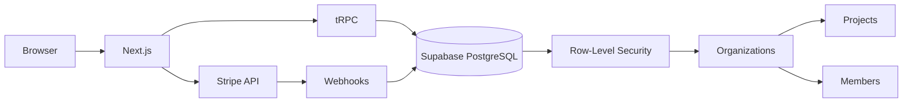

# saas-starter

Production-ready SaaS starter with Supabase Auth, multi-tenancy, Stripe billing, and tRPC. Demonstrates full product thinking — from auth flows to team RBAC to billing integration.

## Why

Building a SaaS requires solving auth, multi-tenancy, billing, and team management correctly. This starter shows all four with real implementation patterns, not toy examples.

## Architecture



## Quick Start

```bash
# Install Supabase CLI: brew install supabase/tap/supabase
supabase start          # local Supabase instance
cp .env.example .env.local
# Fill in NEXT_PUBLIC_SUPABASE_URL and keys from `supabase status`
pnpm install
pnpm dev               # http://localhost:3000
```

## Tech Stack

| Technology | Version | Why |
|-----------|---------|-----|
| Next.js | 15.3 | App Router, Server Actions |
| Supabase JS | 2.100 | Auth + PostgreSQL + Realtime |
| tRPC | 11.15 | End-to-end type-safe API |
| Stripe | 17 | Billing, subscriptions, webhooks |
| Tailwind CSS | v3 | Styling |
| Zod | 3 | Input validation |

## Features

- **Auth**: Email/password + GitHub/Google OAuth via Supabase
- **Multi-tenancy**: Organizations with member roles (owner/admin/member/viewer)
- **RBAC**: Row-level security on every table
- **Billing**: Free/Pro/Team plans via Stripe
- **tRPC**: Type-safe API calls with React Query
- **Server Actions**: Form submissions without API routes
- **Realtime**: Dashboard updates via Supabase subscriptions

## Database Schema

Tables: `users`, `organizations`, `org_members` (roles), `projects`, `subscriptions`, `invoices`, `audit_log`

RLS policies on every table enforce org-scoped access.

## Configuration

| Variable | Description | Required |
|----------|-------------|----------|
| `NEXT_PUBLIC_SUPABASE_URL` | Supabase project URL | Yes |
| `NEXT_PUBLIC_SUPABASE_ANON_KEY` | Supabase anon key | Yes |
| `SUPABASE_SERVICE_ROLE_KEY` | Service role key (server only) | Yes |
| `STRIPE_SECRET_KEY` | Stripe secret key | Yes |
| `STRIPE_WEBHOOK_SECRET` | Webhook signing secret | Yes |

## Testing

```bash
pnpm test      # unit + integration (uses local Supabase)
pnpm test:e2e  # Playwright: signup -> project -> invite -> upgrade
```

## License

MIT
