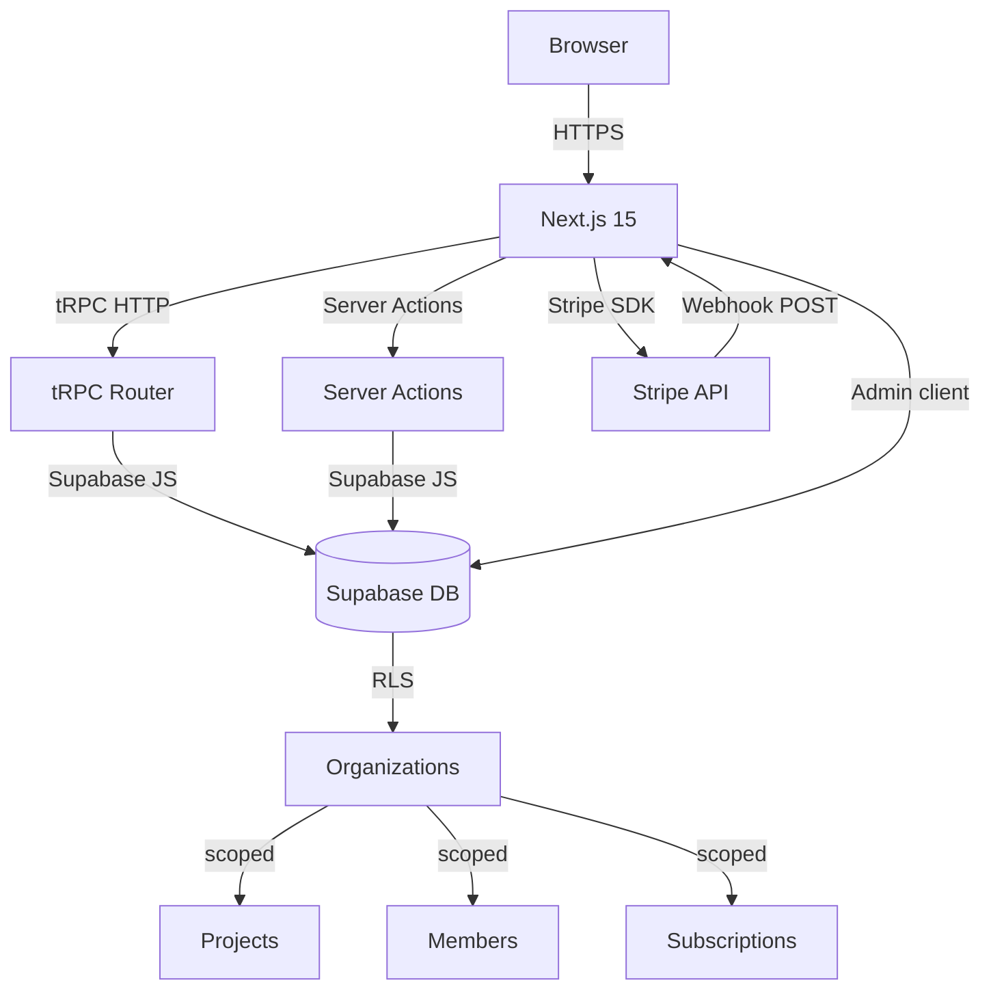

# Architecture

## Overview

saas-starter is a Next.js 15 App Router application backed by Supabase (PostgreSQL + Auth) and Stripe. All data access flows through tRPC procedures that run inside Next.js API route handlers, giving end-to-end TypeScript types from the database to the React component.

## Request flow

```
Browser (React, tRPC client)
  -> /api/trpc/[trpc]  (Next.js API route)
    -> tRPC router
      -> protectedProcedure (auth middleware)
        -> Supabase client (RLS-enforced queries)
          -> PostgreSQL (Supabase)
```

For Server Components and Server Actions, the Supabase server client is used directly — no tRPC hop.

## Directory structure

```
src/
  app/
    (auth)/          # sign-in, sign-up, OAuth callback
    (dashboard)/     # authenticated app shell + pages
    (marketing)/     # landing page, pricing
    api/
      trpc/[trpc]/   # tRPC HTTP handler
      webhooks/stripe/ # Stripe webhook receiver
  actions/           # Server Actions (auth, projects)
  components/
    dashboard/       # Sidebar, ProjectCard
    marketing/       # (reserved)
    providers/       # TRPCProvider (QueryClient setup)
    ui/              # PricingCard, shared primitives
  lib/
    supabase/        # client.ts, server.ts, admin.ts
    stripe/          # client.ts, plans.ts, webhooks.ts
    trpc/            # router.ts, trpc.ts, context.ts, client.ts
      routers/       # projects.ts, teams.ts
  types/
    database.ts      # TypeScript types matching DB schema
  middleware.ts      # Auth session refresh + route guards
```

## Route groups

| Group | Path prefix | Auth required |
|-------|-------------|---------------|
| `(auth)` | `/sign-in`, `/sign-up` | No (redirects if logged in) |
| `(dashboard)` | `/dashboard/*` | Yes (middleware redirect) |
| `(marketing)` | `/`, `/pricing` | No |

## tRPC design

- `publicProcedure` — unauthenticated (not currently exposed externally)
- `protectedProcedure` — requires valid Supabase session; user injected into context
- All mutations validate input with Zod schemas
- Error formatting includes `zodError` flattening for form-level field errors

## Caching strategy

- Server Components: `no-store` implicitly (dynamic rendering with `cookies()`)
- tRPC queries: `staleTime: 30s` in QueryClient defaults
- Webhook route: `no-store`, raw body streaming required for Stripe signature verification

## Security headers

Configured in `next.config.ts`:
- `X-Frame-Options: DENY`
- `X-Content-Type-Options: nosniff`
- `Referrer-Policy: strict-origin-when-cross-origin`
- `Strict-Transport-Security` with 2-year max-age
- `Content-Security-Policy` scoped to Supabase + self

## Mermaid system diagram


