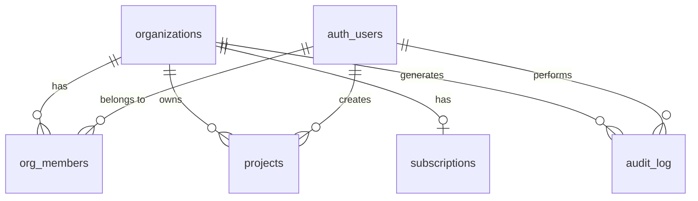

# Database Schema

## Tables

### organizations

| Column | Type | Description |
|--------|------|-------------|
| id | uuid (PK) | Auto-generated |
| name | text | Display name |
| slug | text (unique) | URL-safe identifier |
| plan | enum (free/pro/enterprise) | Current billing plan |
| stripe_customer_id | text (nullable) | Stripe customer ID |
| created_at | timestamptz | Auto-set |
| updated_at | timestamptz | Auto-updated |

### org_members

| Column | Type | Description |
|--------|------|-------------|
| id | uuid (PK) | Auto-generated |
| org_id | uuid (FK -> organizations) | Organization reference |
| user_id | uuid (FK -> auth.users) | Supabase user |
| role | enum (owner/admin/member/viewer) | Role within org |
| invited_by | uuid (nullable, FK -> auth.users) | Who sent the invite |
| joined_at | timestamptz | When they joined |

### projects

| Column | Type | Description |
|--------|------|-------------|
| id | uuid (PK) | Auto-generated |
| org_id | uuid (FK -> organizations) | Owner organization |
| name | text | Project name |
| description | text (nullable) | Optional description |
| status | enum (active/archived/completed) | Project state |
| created_by | uuid (FK -> auth.users) | Creator |
| created_at | timestamptz | Auto-set |
| updated_at | timestamptz | Auto-updated |

### subscriptions

| Column | Type | Description |
|--------|------|-------------|
| id | uuid (PK) | Auto-generated |
| org_id | uuid (FK -> organizations) | Owner organization |
| stripe_subscription_id | text (nullable) | Stripe subscription ID |
| stripe_price_id | text (nullable) | Stripe price ID |
| status | enum (active/inactive/canceled/past_due/trialing/unpaid) | Stripe status |
| current_period_end | timestamptz (nullable) | When current period ends |
| cancel_at_period_end | boolean | Scheduled for cancellation |
| created_at | timestamptz | Auto-set |
| updated_at | timestamptz | Auto-updated |

### audit_log

| Column | Type | Description |
|--------|------|-------------|
| id | uuid (PK) | Auto-generated |
| org_id | uuid (nullable) | Organization context |
| user_id | uuid (nullable) | Acting user |
| action | text | What happened |
| resource_type | text | Table/entity type |
| resource_id | text (nullable) | Affected record ID |
| metadata | jsonb (nullable) | Extra context |
| created_at | timestamptz | When it happened |

## ER Diagram



## Row-Level Security policies

All tables have RLS enabled. The pattern is:

```sql
-- org_members: only members of the org can see membership rows
CREATE POLICY "org_members_select" ON org_members
  FOR SELECT USING (
    org_id IN (
      SELECT org_id FROM org_members WHERE user_id = auth.uid()
    )
  );

-- projects: org members can read; creator or admin can write
CREATE POLICY "projects_select" ON projects
  FOR SELECT USING (
    org_id IN (
      SELECT org_id FROM org_members WHERE user_id = auth.uid()
    )
  );
```

See `supabase/migrations/` for the full policy definitions.

## DB functions

### check_project_limit(p_org_id uuid) -> boolean

Returns `true` if the org is within their plan's project limit. Called by the tRPC `projects.create` procedure before inserting.

```sql
-- Simplified logic
SELECT CASE
  WHEN org.plan = 'free' THEN (
    SELECT COUNT(*) FROM projects WHERE org_id = p_org_id
  ) < 3
  ELSE true
END
FROM organizations org WHERE org.id = p_org_id;
```
